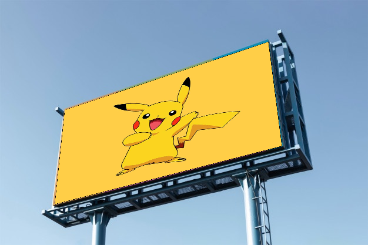

# Image_Overlaying_Using_Perspective_Transform
Using the concept of Perspective Transform to overlay one image onto another with OpenCV-Python  

## Overview
In this project, we use opencv to warp an image and merge it with another image. The code is written in such a way that it allows us to choose four points in the base image. The subject image is warped in such a way that it fits within the boundary outlined by the chosen points. For more details you can refer to my article on **Medium [here](https://towardsdatascience.com/what-is-perspective-warping-opencv-and-python-750e7a13d386)**. The base image is on the left, and the subject image is on the right.

   

**Selecting the corner points**   
Every time you click on a point, the chosen point is highlighted using a red dot as shown below.  

  

## Output :
   

## Usage :

To run without debug enabled :-  
`python main.py --base_img base_img.jpg --subject_img subject.jpg`

To run with debug enabled :-  
`python main.py --base_img base_img.jpg --subject_img subject.jpg --debug True`

Enabling debug would allow you to visualize the intermediate masks and processed images so that 
you can better analyze where you're going wrong and remedy the problem accordingly.

Do let me know if you face any issues. I'll do my best to help :)  
Happy Learning People ! Keep chasing your dreams ! ⭐️
